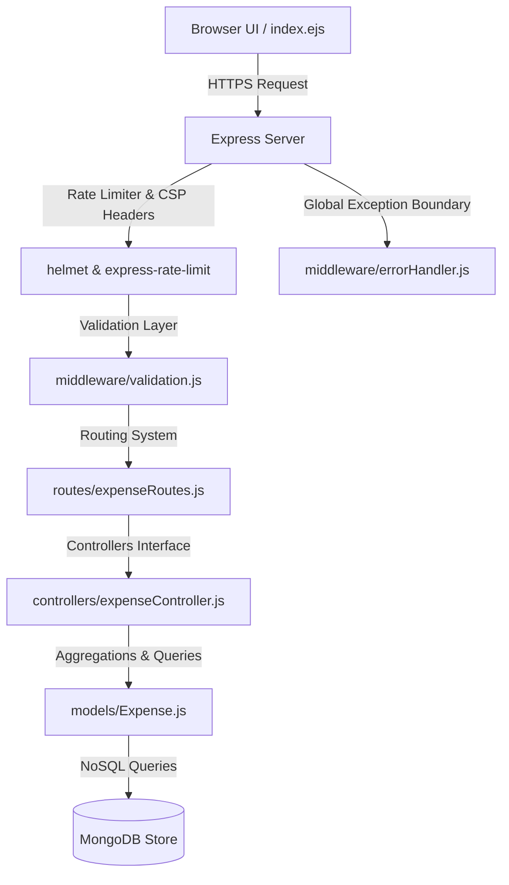

# Ravi's Expense Tracker

[](https://github.com/ravir/expense-tracker/actions/workflows/ci.yml)
[](https://opensource.org/licenses/MIT)
[](https://nodejs.org)
[](https://www.mongodb.com)

A high-performance, secure, and premium financial management dashboard engineered using Node.js, Express, and MongoDB. Featuring a glassmorphic user interface, dynamic SVG undulation background (Ethereal Shadows), real-time mouse-tracking lighting effects, server-side data validations, and advanced MongoDB aggregations.

---

## 🏛️ System Architecture



---

## 🛠️ Tech Stack

- **Frontend:** HTML5, EJS Template Engine, Vanilla CSS (Glassmorphic Styling), Tailwind CSS CDN, Chart.js, HTML5 Canvas
- **Backend:** Node.js, Express.js
- **Database:** MongoDB, Mongoose ODM
- **Security:** Helmet CSP Headers, Express-Rate-Limit (DDoS Mitigation)
- **Testing:** Jest, Supertest

---

## ⚡ Features

1. **Top-Level Metrics Strip:** Computes cumulative spent, active items, and peak outflow dynamically on the database server.
2. **Ethereal Shadows Background:** Dynamic SVG displacement filter (`feTurbulence`, `feColorMatrix`, `feDisplacementMap`) simulating liquid movement.
3. **Interactive Mouse Tracking:** Adjusts radial lighting coordinates dynamically matching mouse pointer motions.
4. **Emoji Category Selectors:** Peer-checked input cards replacing standard dropdown elements.
5. **Interactive Filter Pills:** Quick tags to filter by category on the server instantly.
6. **Analytics Progress Bars:** Showsspent ratios per category alongside Chart.js doughnut breakdowns.
7. **Robust Input Sanity:** Validation checks matching rules (e.g. descriptions under 100 characters, positive values).
8. **Resilient DB Failover:** Event listeners checking connection status.

---

## 🚀 Quick Start

### Prerequisites

- Node.js (v18.x or above)
- MongoDB running locally or remotely

### Installation

1. Clone the repository:
   ```bash
   git clone https://github.com/ravir/expense-tracker.git
   cd expense-tracker
   ```

2. Install dependencies:
   ```bash
   npm install
   ```

3. Configure environment settings. Create a `.env` file in the root directory:
   ```env
   PORT=3001
   MONGO_URI=mongodb://localhost:27017/expense_tracker
   NODE_ENV=development
   ```

4. Start the application:
   ```bash
   npm run dev
   ```
   Open [http://localhost:3001](http://localhost:3001) in your browser.

---

## 🐳 Docker Deployment

Run the system in containerized form using Docker Compose:

```bash
# Build and run containers
docker-compose up --build -d

# Stop containers
docker-compose down
```

---

## 🧪 Testing

To run the Jest automated test suite:

```bash
# Run unit and integration tests
npm test
```

---

## 📂 Repository Layout

```
├── .github/              # GitHub Actions & policies
├── config/               # Database connection configs
├── controllers/          # Business logic handlers
├── middleware/           # Validation and error boundary layers
├── models/               # MongoDB Mongoose schemas
├── routes/               # Express endpoint routes
├── tests/                # Automated Jest test specs
├── views/                # EJS user interface views
├── Dockerfile            # Container manifest
├── docker-compose.yml    # Docker Compose settings
├── server.js             # Server entry point
└── package.json          # Node scripts and dependencies
```

---

## 🔒 Security

We employ Helmet to enforce security headers (such as strict Content Security Policy rules) and express-rate-limit to protect endpoints from brute-force spamming. See [SECURITY.md](SECURITY.md) for vulnerability reports.

---

## 📄 License

Distributed under the MIT License. See [LICENSE](LICENSE) for more details.

---

## 👤 Author

**Ravi Ranjan Singh** - [GitHub Profile](https://github.com/ravir)
