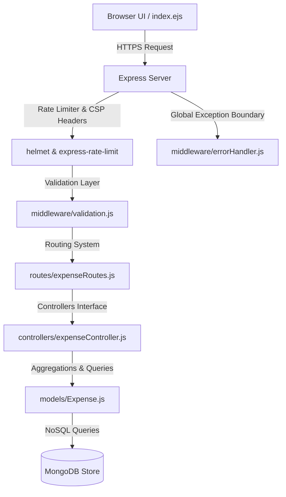

# Ravi's Expense Tracker

[](https://github.com/Hellthefox808/Expense-tracker/actions/workflows/ci.yml)
[](https://opensource.org/licenses/MIT)
[](https://nodejs.org)
[](https://www.mongodb.com)

A high-performance, secure, and premium financial management dashboard engineered using Node.js, Express, and MongoDB. The system features a glassmorphic user interface, dynamic SVG undulation background (Ethereal Shadows), real-time mouse-tracking lighting effects, server-side data validations, and advanced MongoDB aggregations.

---

## System Architecture

The project is structured according to the classic Model-View-Controller (MVC) pattern, supplemented with dedicated middleware layers for input validation, security enforcement, and global exception boundaries.



---

## Design & Aesthetic Highlights

### Glassmorphic Interface & Holographic Tilt
The user interface implements premium glassmorphic UI elements using customized CSS backdrop filters:
*   **3D Perspective Tilt:** The container elements leverage CSS 3D perspectives (`perspective: 1200px` and `transform-style: preserve-3d`) to tilt dynamically matching mouse movements.
*   **Iridescent Reflex Overlay:** Uses a `radial-gradient` that tracks the cursor coordinates to generate interactive lighting and reflection overlays on cards.

### Ethereal Shadows SVG Displacement
Background fluid motions are generated dynamically using an SVG displacement filter, avoiding heavy video assets:
```xml
<filter id="ethereal-displacement">
  <feTurbulence type="fractalNoise" baseFrequency="0.015" numOctaves="3" result="noise" />
  <feDisplacementMap in="SourceGraphic" in2="noise" scale="35" xChannelSelector="R" yChannelSelector="G" />
</filter>
```

---

## Database Schema & Optimization

The database is built on MongoDB via Mongoose. Data fields are configured with strict validations and indexing:

### 1. Data Model Schema
See the model implementation in [models/Expense.js](file:///c:/Users/ravir/Desktop/PROJECT/p1/expense%20tracker/models/Expense.js):
*   `description`: Non-empty string, trimmed, capped at 100 characters.
*   `amount`: Numeric float, minimum `0.01` (representing transactions starting from ₹0.01).
*   `category`: String restricted to enum values: `Food`, `Education`, `Technology`, `Entertainment`, `Other`.
*   `date`: Using custom schema timestamps, indexed for chronological feed sorting.

### 2. High-Performance Indexing
To ensure high performance under heavy read/write loads, we implement:
*   An index on the `date` field for chronological feed sorting.
*   A **compound index** on `{ category: 1, date: -1 }` to optimize category filtering combined with chronological sorting:
    ```javascript
    expenseSchema.index({ category: 1, date: -1 });
    ```

### 3. Server-Side Data Aggregation
Metrics (total outflow and category ratios) are calculated dynamically on the database using MongoDB Aggregations:
```javascript
const stats = await Expense.aggregate([
    {
        $group: {
            _id: '$category',
            total: { $sum: '$amount' }
        }
    }
]);
```

---

## Security & Input Validation

The system implements security-in-depth across both middleware and network layers:
1.  **Content Security Policy (CSP):** Configured via [Helmet](file:///c:/Users/ravir/Desktop/PROJECT/p1/expense%20tracker/server.js#L18-L49) to allow only trusted resources from Tailwind and JSDelivr CDNs.
2.  **Rate Limiter:** Limits incoming requests to `150` queries per `15 minutes` window per IP to mitigate brute-force and DDoS attacks.
3.  **Strict Validation Layer:** Handles request sanitization before database operations. Located in [middleware/validation.js](file:///c:/Users/ravir/Desktop/PROJECT/p1/expense%20tracker/middleware/validation.js).
4.  **Graceful Shutdown:** The server listens to `SIGTERM` and `SIGINT` signals to safely close database connections and pending HTTP requests before exiting.

---

## API Documentation

| Endpoint | Method | Payload / Query Params | Description |
|---|---|---|---|
| `/` | `GET` | `?page=<number>&search=<text>&category=<name>` | Renders the main dashboard with paginated, filtered expenses. |
| `/add` | `POST` | `{ description, amount, category }` | Sanitizes and adds a new transaction document. |
| `/delete/:id` | `DELETE` | None | Removes a transaction by ID. Supported via `method-override`. |

---

## Repository Layout

*   [.github/](file:///c:/Users/ravir/Desktop/PROJECT/p1/expense%20tracker/.github/) - GitHub workflows (CI setup) and issue templates
*   [config/db.js](file:///c:/Users/ravir/Desktop/PROJECT/p1/expense%20tracker/config/db.js) - MongoDB connection helper using Mongoose
*   [controllers/expenseController.js](file:///c:/Users/ravir/Desktop/PROJECT/p1/expense%20tracker/controllers/expenseController.js) - MVC controllers implementing database search and aggregations
*   [middleware/](file:///c:/Users/ravir/Desktop/PROJECT/p1/expense%20tracker/middleware/) - Custom input validation and exception boundary handlers
*   [models/Expense.js](file:///c:/Users/ravir/Desktop/PROJECT/p1/expense%20tracker/models/Expense.js) - Schema definition and indexing configurations
*   [routes/expenseRoutes.js](file:///c:/Users/ravir/Desktop/PROJECT/p1/expense%20tracker/routes/expenseRoutes.js) - REST API routing configurations
*   [scripts/seed.js](file:///c:/Users/ravir/Desktop/PROJECT/p1/expense%20tracker/scripts/seed.js) - DB mock seeding script
*   [tests/](file:///c:/Users/ravir/Desktop/PROJECT/p1/expense%20tracker/tests/) - Automated Jest integration tests
*   [views/index.ejs](file:///c:/Users/ravir/Desktop/PROJECT/p1/expense%20tracker/views/index.ejs) - Frontend dashboard template
*   [server.js](file:///c:/Users/ravir/Desktop/PROJECT/p1/expense%20tracker/server.js) - Server entrypoint with Graceful Shutdown & security settings

---

## Quick Start & Deployment

### 1. Prerequisites
*   Node.js (v18.x or above)
*   MongoDB running locally or remotely

### 2. Environment Configurations
Create a `.env` file in the root directory:
```env
PORT=3001
MONGO_URI=mongodb://localhost:27017/expense_tracker
NODE_ENV=development
```

### 3. Installation & Local Development
```bash
# 1. Install dependencies
npm install

# 2. Seed mock data for dashboard visualization
npm run seed

# 3. Start development server
npm run dev
```
Open [http://localhost:3001](http://localhost:3001) in your browser.

### 4. Docker Deployment
Deploy the containerized app and MongoDB instance using Docker Compose:
```bash
# Build and run containers
docker-compose up --build -d

# View service logs
docker-compose logs -f

# Shut down containers
docker-compose down
```

---

## Testing Suite

Automated integration tests are implemented with Jest and Supertest.
```bash
# Run tests
npm test
```
The test suite validates:
*   Server routing and EJS rendering
*   Input validation failures (400 responses)
*   Successful database creation and redirection
*   404 handling for unknown endpoints

---

## Author

**Ravi Ranjan Singh** - [GitHub Profile](https://github.com/ravir)
